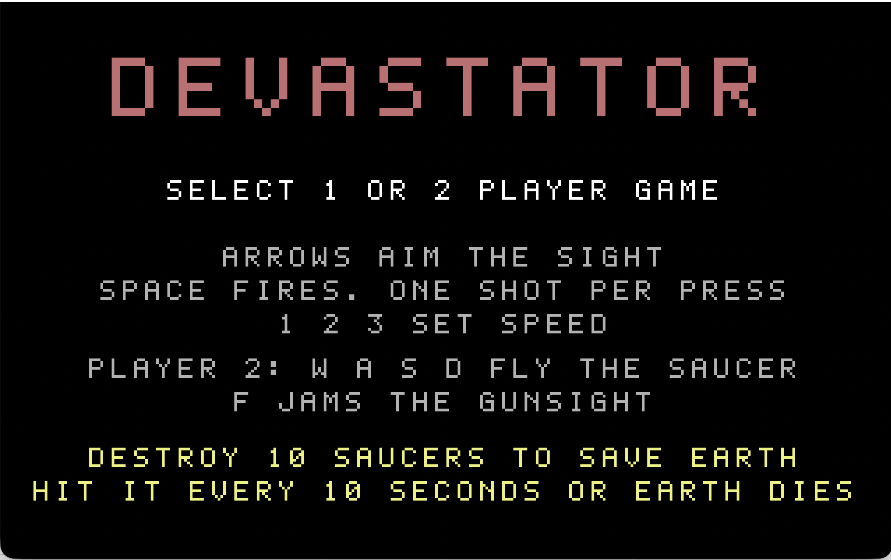
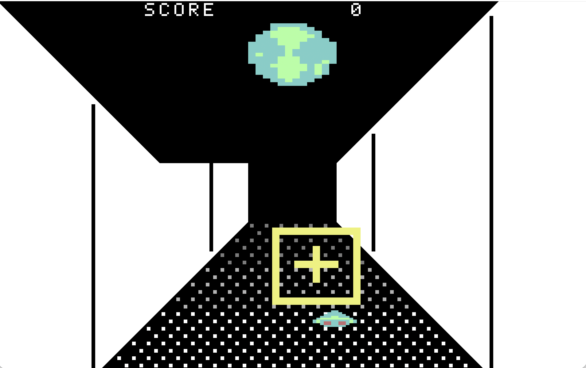

# Devastator

**macOS only.** A native Mac port of Devastator, the Commodore 64 type-in
game from [COMPUTE! magazine issue 51, August 1984](https://www.atarimagazines.com/compute/issue51/192_1_Devastator.php),
built with [FutureBasic](https://www.brilorsoftware.com/fb/pages/home.html).
The original needed a joystick; this port uses the keyboard. There is no
Windows or Linux version.

## Install (prebuilt app)

1. Download `Devastator.app.zip` from this repository's Releases page and
   unzip it.
2. The app is unsigned. On first launch, right-click `Devastator.app`,
   choose Open, then confirm. If macOS still refuses:
   `xattr -dc Devastator.app`
3. Requires an Apple Silicon Mac running macOS 11 or later. Intel Macs:
   build from source and set Build Settings > Architecture accordingly.

## Build from source

1. Install [FutureBasic](https://www.brilorsoftware.com/fb/pages/home.html)
   (freeware, macOS).
2. Open `Devastator/Devastator.fbeproj` and press Cmd-R.

## Play

The Devastator saucer is attacking Earth. Land a hit at least every 10
seconds or the Earth is destroyed. A hit scores 10 points. Ten hits destroy
a saucer; each destroyed saucer changes direction faster. Destroy ten
saucers to save the Earth.

A shot only connects when the crosshair itself overlaps the saucer, not the
outer box.

| Key | Action |
|---|---|
| 1 / 2 | select 1 or 2 player game (menu) |
| Arrows | aim the gunsight |
| Space | fire, one shot per press |
| 1 / 2 / 3 | difficulty slow / medium / fast (in game) |
| W A S D | player 2 flies the saucer |
| F | player 2 jams the gunsight small |
| Return | replay after a game ends |
| Q | quit after a game ends |
| Esc | back to the menu |

## Credits

- Original game: "Devastator" by David R. Arnold, COMPUTE! issue 51,
  August 1984, page 58. Commodore 64 machine language portion by Gregg
  Peele, COMPUTE! Publications.
- Article text: [Classic Computer Magazine Archive](https://www.atarimagazines.com/compute/issue51/192_1_Devastator.php)
- Scanned issue: [Internet Archive](https://archive.org/details/1984-08-compute-magazine)
- FutureBasic compiler: [Brilor Software](https://www.brilorsoftware.com/fb/pages/home.html)
- macOS FutureBasic port: Wells (wells01440), 2026, written with Claude.

Original game design and sprite data copyright 1984 COMPUTE! Publications,
Inc. and the authors. The sprite bitmaps in GameData.incl are reproduced
from the published listing. The port is a non-commercial preservation
project. The port's source code is MIT licensed; see LICENSE.

## Source fidelity

Sprites (saucer, crosshair, box, three Earth frames) are byte-identical to
the original machine language data. Movement clamps, speeds, the fire gate,
the 20-frame hit pause, the 10-second doom clock, wave count, and scoring
follow the disassembly at $C000-$C6CB and match the article's stated rules.
The playfield fill in the original BASIC listing is glitched; this port
draws the intended symmetric corridor. Difficulty selection moves from
F1/F3/F5 to 1/2/3. The original toggled crosshair size with SHIFT/LOCK;
the port instead gives the shrink to player 2 as a held jam key (F).
Sound is synthesized to approximate the SID drone, shot, hit sweep, and
explosion.
